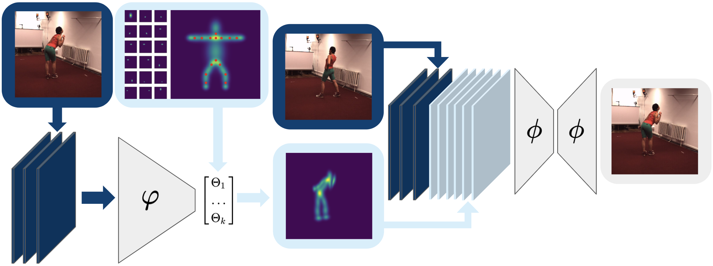

## Unsupervised Human Pose Estimation through Transforming Shape Templates
[Luca Schmidtke1](https://www.linkedin.com/in/luca-schmidtke/), [Athanasios Vlontzos1](https://scholar.google.co.uk/citations?user=XTkiyj4AAAAJ&hl=en), [Simon Ellershaw1](https://www.linkedin.com/in/simon-ellershaw-41327b154/?originalSubdomain=uk), [Anna Lukens,3](http://www.perinatal-functional-imaging.co.uk/) [Tomoki Arichi2](http://www.perinatal-functional-imaging.co.uk/) and [Bernhard Kainz1](http://bernhard-kainz.com/)

1Imperial College London, 2 King's College London, 3 Evelina Children's Hospital

  
### Abstract
Human pose estimation is a major computer vision problem with applications ranging from augmented reality and video capture to
surveillance and movement tracking. In the medical context, the latter may be an important biomarker for neurological impairments in
infants. Whilst many methods exist, their application has been limited by the need for well annotated large datasets and the inability to
generalize to humans of different shapes and body compositions, e.g. children and infants. In this paper we present a novel method for
learning pose estimators for human adults and infants in an unsupervised fashion. We approach this as a learnable template matching
problem facilitated by deep feature extractors. Human-interpretable landmarks are estimated by transforming a template consisting of
predefined body parts that are characterized by 2D Gaussian distributions. Enforcing a connectivity prior guides our model to meaningful
human shape representations. We demonstrate the effectiveness of our approach on two different datasets including adults and infants.

### Results (infants)

  <video src="infant_clip1.mp4" width="414*1.3" height="207*1.3" controls preload> </video>
  <video src="infant_clip2.mp4" width="414*1.3" height="207*1.3" controls preload> </video>

### Results (adults, Human3.6m)

  <video src="h36m_clip1.mp4" width="414*1.3" height="207*1.3" controls preload> </video>
  <video src="h36m_clip2.mp4" width="414*1.3" height="207*1.3" controls preload> </video>

### Paper
coming soon

### Code
coming soon

